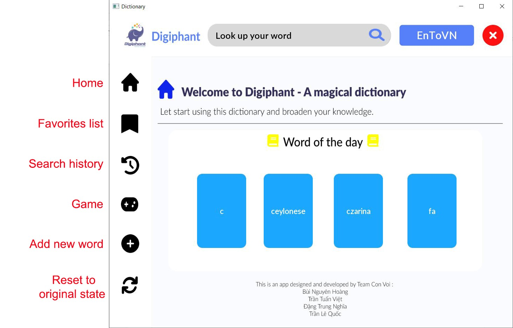
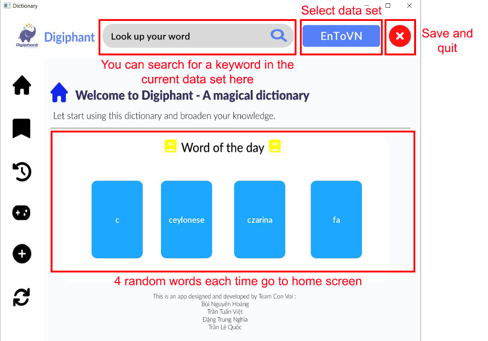
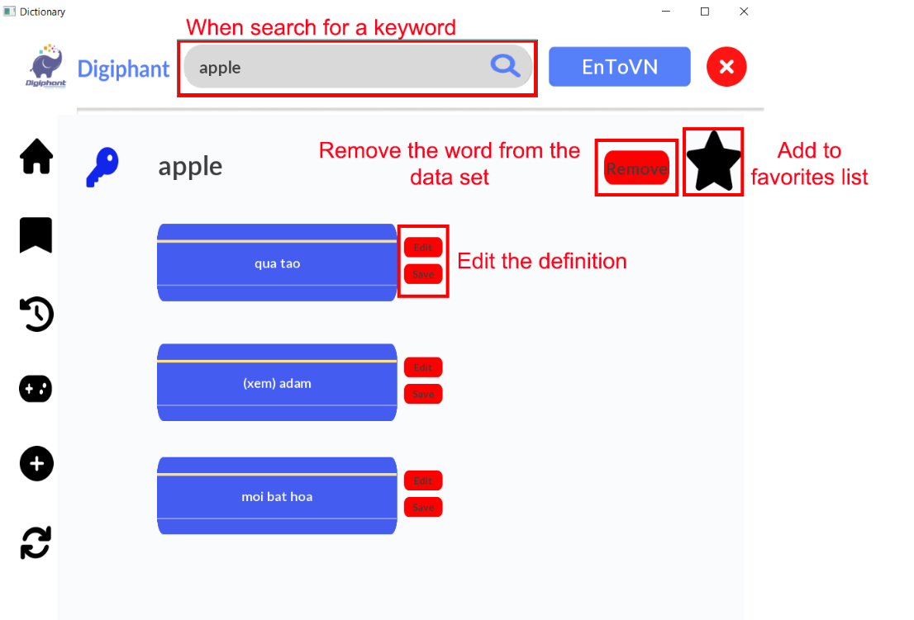
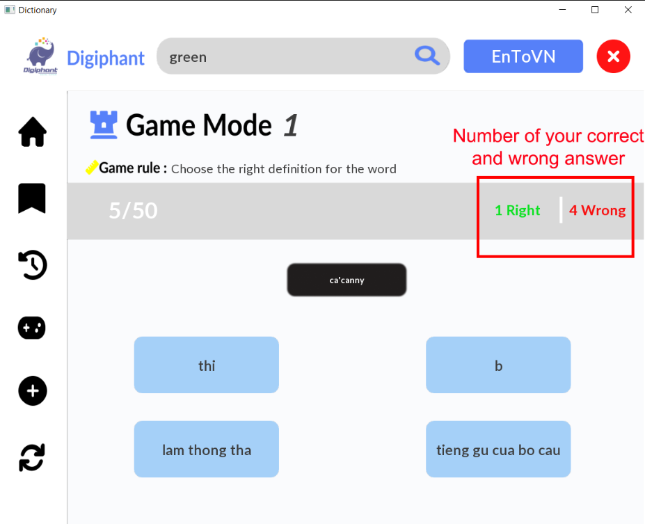
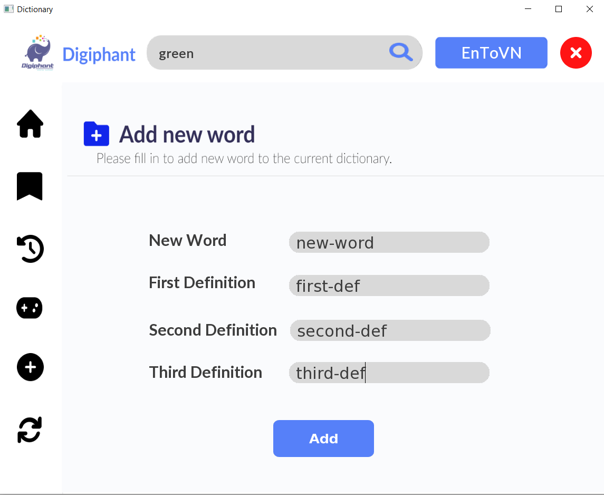

# Dictionary
This is the Dictionary Application created by group 12 - CS163 - 21APCS1

## Members
* 21125029 - Tran Tuan Viet
* 21125161 - Bui Nguyen Hoang
* 21125020 - Dang Trung Nghia
* 21125093 - Tran Le Quoc

## Description
The Application is coded in C++17 using the [TGUI Library](https://tgui.eu/tutorials/1.0/).

My Dictionary is an application to help users look up the meanings of words from English to Vietnamese, Vietnamese to English, Slang in English and Emotion to English too.
Beside searching word, our application also has some outstanding features:
* Friendly Interface to interact with users
* Word of the day: Generate random 4 words for users to review new words each time we go to Home of our App
* View history of our searching
* View our favourite word
* Adding new word and Remove existed word
* Game: to practice our vocabulary

## Getting Started
### Installing
* Clone the project to your computer. 
```
  git clone https://github.com/hoangteo0103/ProjectCS163-Dictionary.git
```
* Set up [TGUI Library](https://tgui.eu/tutorials/1.0/visual-studio/).

### Executing program
* Using an IDE to compile this game (Codeblocks, Visual Studio, ...)
* Remember to add all source codes to project before building and running

## Usage
* The detail of our Dictionary Application is in the [Report.pdf](https://github.com/hoangteo0103/ProjectCS163-Dictionary/blob/main/Project%20-%20Final%20Submission%20-%20Group12/Manual/Manual.pdf).
* Download and read [Report.pdf](https://github.com/hoangteo0103/ProjectCS163-Dictionary/blob/main/Project%20-%20Final%20Submission%20-%20Group12/Manual/Manual.pdf) to get the general view of Dictionary Application.

* Menu
<div align = "center">
  
</div>

* Searching bar and Word of the day
<div align = "center">
  
</div>

* In searching
<div align = "center">
  
</div>

* Game
<div align = "center">
  
</div>

* Add a new word
<div align = "center">
  
</div>

## Contact
Tran Tuan Viet - ttviet2805@gmail.com
